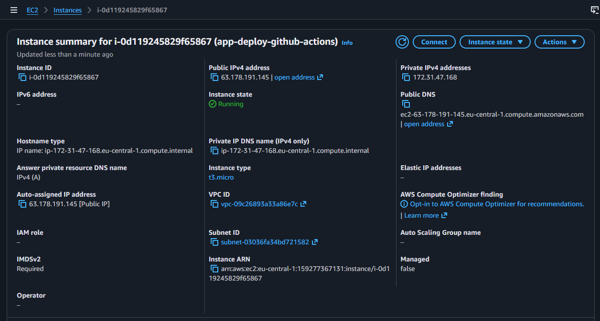
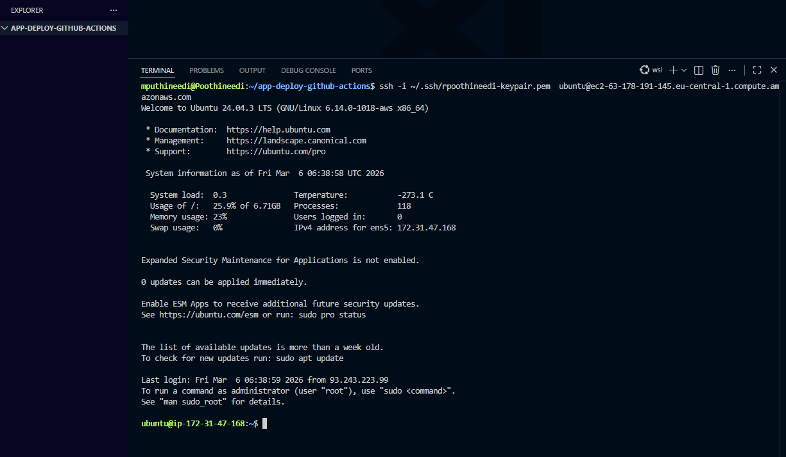
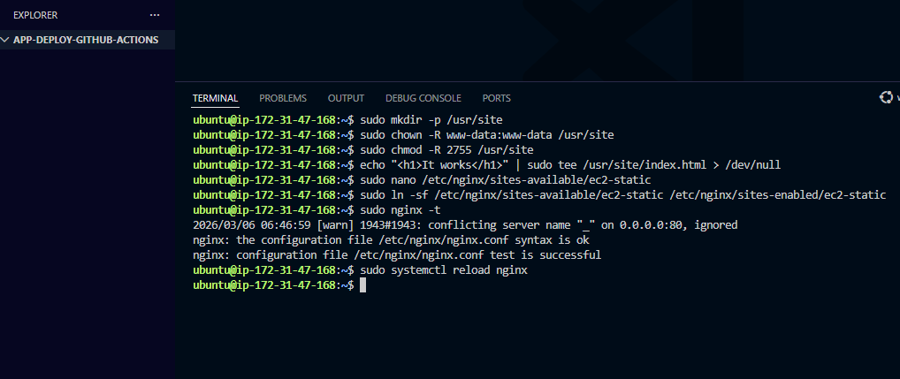
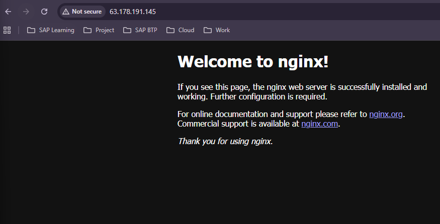
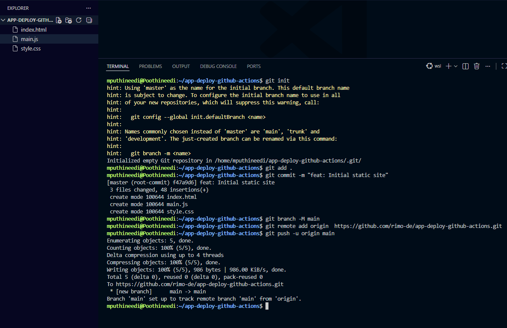
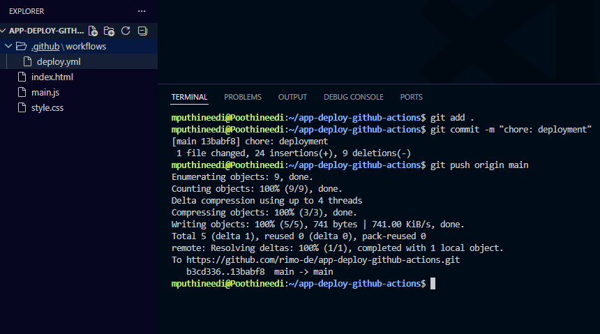
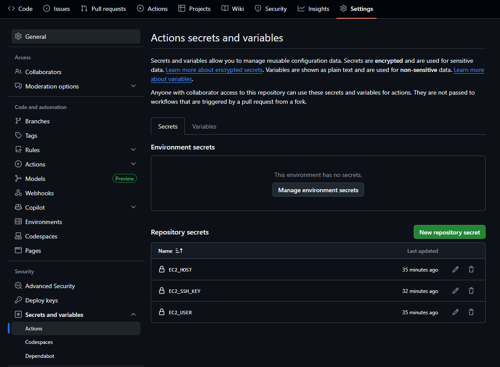
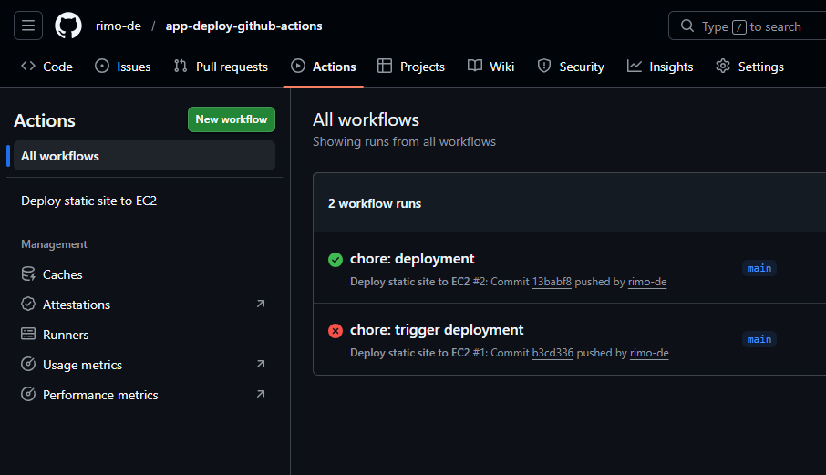

# Deploy a Static Website to EC2 with GitHub Actions

This project shows how to deploy a simple static website (`HTML`, `CSS`, `JS`) to an **AWS EC2 Ubuntu instance** using **GitHub Actions** and **Nginx**.

Every push to the `main` branch triggers a GitHub Actions workflow that:

1. Connects to the EC2 instance over SSH
2. Copies the website files to the server
3. Reloads Nginx
4. Publishes the updated website automatically

---

What this project does

This repository contains a small static website and a GitHub Actions workflow that deploys it to an EC2 instance. The deployment flow is:

```text
Local project → GitHub repo → GitHub Actions → EC2 Ubuntu server → Nginx → Browser
```

## Step 1 — Launch and verify the EC2 instance

Create an Ubuntu EC2 instance and make sure it is running.

Use either the Public IPv4 address or Public DNS later in GitHub Secrets.



## Step 2 — Connect to the EC2 instance with SSH

From your terminal, connect to the server using your .pem file.

Example:

ssh -i ~/.ssh/your-keypair.pem ubuntu@your-ec2-public-dns

Once connected, verify that SSH works correctly.



## Step 3 — Prepare the Nginx web folder on EC2

Create a custom directory for the site and configure permissions so Nginx can serve files from it.

Example commands used on the server:

```bash
sudo mkdir -p /usr/site
sudo chown -R www-data:www-data /usr/site
sudo chmod -R 755 /usr/site
```

Then create or update the Nginx site configuration and reload Nginx.

Example verification:

```bash
sudo nginx -t
sudo systemctl reload nginx
```



## Step 4 — Verify Nginx is running

After configuring Nginx, open the EC2 public IP in your browser.

At this stage, you may still see the default Nginx page. That is fine — it confirms that Nginx is installed and accessible



## Step 5 — Create the local project and push it to GitHub

This project contains:

- index.html
- style.css
- main.js

Initialize Git, commit the files, rename the branch to main, and push to GitHub.

Example:

```bash
git init
git add .
git commit -m "feat: initial static site"
git branch -M main
git remote add origin https://github.com/<your-username>/<your-repo>.git
git push -u origin main
```



## Step 6 — Add the GitHub Actions workflow

Create this file:

```text
.github/workflows/deploy.yml
```



## Step 7 — Add GitHub repository secrets

In your GitHub repository, go to:

```text
Settings → Secrets and variables → Actions
```



## Step 8 — Trigger deployment

Push any new change to the main branch.

GitHub Actions will automatically:

- prepare SSH
- connect to the server
- copy files to EC2
- run remote commands
- reload Nginx

You can watch the workflow run in the Actions tab.

A successful run should appear with a green check mark.


